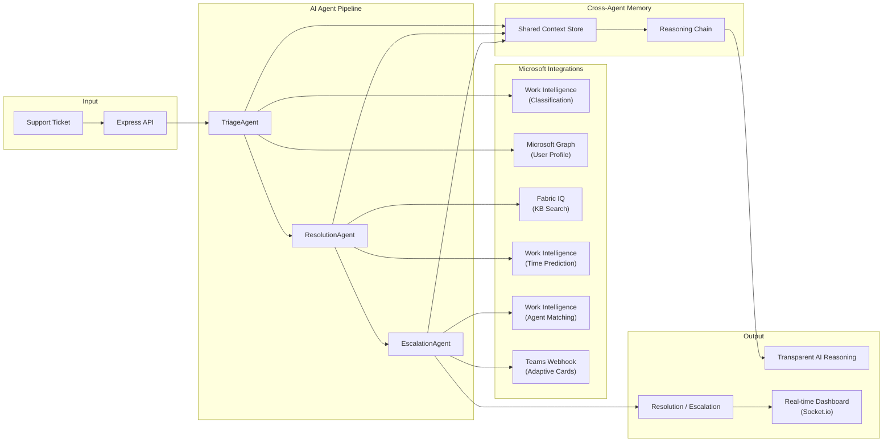

# SupportSense AI

**Enterprise Support Intelligence** for the Microsoft Agents League Hackathon 2025 — Enterprise Agents Track (Work Intelligence + Fabric IQ tier).

SupportSense AI is a three-agent autonomous support pipeline that triages, resolves, and escalates enterprise IT tickets using Microsoft Graph, Fabric IQ, and a Work Intelligence Layer built on Graph — with transparent AI reasoning, cross-agent shared memory, and full demo mode requiring zero credentials.

## Live Demo

Experience the live application without setting up credentials:
- **Instant Demo**: Open the client interface and click **Run Demo Pipeline** in the top header.
- **Visual Event Feed**: Watch the real-time event logs update as the AI agents process the ticket.
- **AI Transparency**: Go to the **Tickets** tab, click on any ticket, and expand the **AI Reasoning** panel to inspect the multi-step reasoning steps.

## Architecture



### Three Named Agents

| Agent | Role | AI Reasoning | Microsoft Integrations |
|-------|------|-------------|----------------------|
| **TriageAgent** | Classify, prioritize, route tickets | NLP intent classification, sentiment analysis, confidence scoring | Microsoft Graph (user profiles, service health), Work Intelligence (employee context) |
| **ResolutionAgent** | Generate solutions, auto-resolve when confident | Semantic KB search, resolution confidence thresholds, auto-resolve decisions | Fabric IQ (knowledge base, similar tickets), Work Intelligence (resolution time prediction) |
| **EscalationAgent** | Agent assignment, SLA tracking, Teams escalation | Multi-factor scoring (skill match, workload, availability, tier), SLA compliance | Work Intelligence (agent matching, workload), Microsoft Teams (Adaptive Card webhooks) |

## Key Features

### 🧠 Multi-Step AI Reasoning
- **7-step transparent reasoning chain** explains every agent decision with confidence scores
- AI pipeline visibility from ticket intake through final routing decision
- Each step shows signals, decisions, and Microsoft technology attribution
- Reasoning chain expanded by default in the UI for immediate inspection

### 🔄 Cross-Agent Collaboration
- **Shared Memory Panel** visualizes how agents share knowledge across the pipeline
- Customer history and sentiment trends inform downstream agent decisions
- Incident pattern detection correlates tickets across categories in real-time

### 🏢 Microsoft Ecosystem Integration
- **Microsoft Graph**: User profiles, service health monitoring, email notifications
- **Fabric IQ**: Semantic knowledge base search, ticket analytics, similar ticket lookup
- **Work Intelligence**: Employee context, agent skill matching, workload insights, resolution prediction (built on Microsoft Graph API)
- **Microsoft Teams**: Adaptive Card escalation notifications via incoming webhooks

### 📊 Real-Time Dashboard
- Socket.io live event feed with pipeline state changes
- Analytics panel with volume trends, SLA compliance, agent performance
- Incident alert banners for correlated ticket patterns

## Security & Reliability

| Feature | Implementation |
|---------|---------------|
| **HTTP Headers** | Helmet with CSP, X-Frame-Options deny, XSS protection |
| **Input Sanitization** | XSS library neutralizes HTML/script injection in ticket submissions |
| **Rate Limiting** | express-rate-limit on POST endpoints (10 req/min) |
| **API Authentication** | API key validation via `x-api-key` header (bypassed in demo mode) |
| **WebSocket Security** | Socket.io handshake token validation |
| **Secrets Management** | `.env` excluded from git, `.env.example` provided |
| **Request Timeouts** | `AbortSignal.timeout(10000)` on all external API calls |
| **Retry Resilience** | Exponential backoff retry wrapper for Microsoft API calls |
| **Graceful Shutdown** | SIGTERM/SIGINT handlers with 10s timeout and connection draining |
| **Database** | SQLite with `better-sqlite3` for transactional persistence |
| **Docker** | Production Dockerfile + docker-compose with health checks |

## Quick Start

### Prerequisites

- Node.js 18+
- npm

### Install & Run

```bash
# Copy environment template
cp .env.example .env

# Install all dependencies
npm run install:all

# Start backend (port 3001) + frontend (port 3000)
npm run dev
```

> [!NOTE]
> The app runs in demo mode by default with zero configuration. All Microsoft API calls use working mock fallbacks. See `.env.example` for production settings.

Open **http://localhost:3000** and click **Run Demo Pipeline** to process 3 sample tickets through all three agents with live Socket.io updates.

### Docker

```bash
docker-compose up --build
```

### Demo Mode (Default)

`DEMO_MODE=true` in `.env` runs the entire app with **zero real credentials**. All Microsoft API calls use working mock fallbacks.

To use live APIs, copy `.env.example` to `.env` and set:

```env
DEMO_MODE=false
AZURE_TENANT_ID=your-tenant-id
AZURE_CLIENT_ID=your-client-id
AZURE_CLIENT_SECRET=your-client-secret
FABRIC_WORKSPACE_ID=your-workspace-id
FABRIC_LAKEHOUSE_ID=your-lakehouse-id
OPENAI_API_KEY=your-openai-key
```

## Copilot Plugin

SupportSense AI exposes a Microsoft Copilot plugin manifest at `/.well-known/ai-plugin.json` with an OpenAPI 3.0 spec at `/openapi.json`, enabling integration with Microsoft 365 Copilot for natural language ticket processing.

## Deploy to Microsoft Teams

SupportSense AI includes a Microsoft Teams app manifest definition to allow sideloading the agent:

1. **Package the manifest**:
   - Create a ZIP archive (e.g. `manifest.zip`) containing `server/teams-manifest/manifest.json` and two placeholder icon files (`color.png` and `outline.png`) at its root.
2. **Sideload the app**:
   - Navigate to the **Microsoft Teams Admin Center** (`https://admin.teams.microsoft.com`).
   - Go to **Teams apps** > **Manage apps**.
   - Click **Upload new app** (or **Publish an app to your org's app catalog**) and select your `manifest.zip`.
   - Click **Publish**.
3. **Usage**:
   - The SupportSense AI agent will be available in chat compose extensions and the command search bar, allowing users to trigger **Submit Support Ticket** to triage issues directly in Teams.

## API Endpoints

| Method | Endpoint | Description |
|--------|----------|-------------|
| GET | `/api/health` | Server health + agent list |
| GET | `/api/config` | Configuration + integration status |
| GET | `/api/tickets` | List all tickets |
| POST | `/api/tickets` | Create & process a ticket through the pipeline |
| GET | `/api/tickets/history` | Processed ticket history |
| GET | `/api/customers/history?email=` | Customer support history + risk profile |
| POST | `/api/demo/seed` | Seed & process 3 demo tickets |
| GET | `/api/analytics` | Fabric IQ ticket analytics + agent performance |
| GET | `/api/agents/workload` | Work Intelligence agent pool + workload insights |
| GET | `/api/sla` | SLA compliance report |
| GET | `/api/services/health` | M365 service health |

## Socket.io Events

Real-time events emitted for every pipeline state change:

- `pipeline:started`, `pipeline:completed`, `pipeline:error`
- `triage:started`, `triage:completed`
- `resolution:started`, `resolution:completed`, `resolution:auto-resolve-completed`
- `escalation:started`, `escalation:completed`, `escalation:agent-assigned`
- `batch:started`, `batch:completed`

## Project Structure

```
SupportSense/
├── server/
│   ├── agents/          TriageAgent, ResolutionAgent, EscalationAgent, reasoningChain
│   ├── services/        microsoftGraph, fabricIQ, workIQ, teamsWebhook
│   ├── pipeline/        supportPipeline orchestrator
│   ├── socket/          Socket.io handlers
│   ├── routes/          REST API with rate limiting
│   ├── middleware/       Auth, validation, sanitization
│   ├── utils/           Logger, retry with exponential backoff
│   ├── db/              SQLite store with auto-migration
│   └── config/          Environment config + integration status
├── client/
│   └── src/
│       ├── components/  Dashboard, TicketList, TicketDetail, ReasoningChain,
│       │                AnalyticsPanel, MemoryPanel, IncidentAlert, PipelineVisualizer
│       ├── hooks/       useSocket
│       └── services/    API client
├── Dockerfile
├── docker-compose.yml
└── .env.example
```

## Deploy in 10 Minutes (Railway)

You can deploy the entire SupportSense AI stack (Node.js backend, React frontend, SQLite database) to Railway in one click:

1. **Fork this repository** to your GitHub account.
2. **Create a new Project on Railway**:
   - Go to [Railway](https://railway.app) and sign in.
   - Click **New Project** > **Deploy from GitHub repo** and select your fork.
3. **Configure Variables**:
   Add the following environment variables in the service settings:
   - `DEMO_MODE=true` (keeps Microsoft APIs in mock mode for instant evaluation)
   - `PORT=3001`
   - `CLIENT_URL` = `${{RAILWAY_STATIC_URL}}` (automatically maps to your frontend build URL)
4. **Deploy**: Railway will automatically detect the `Dockerfile`, build the React app, compile the backend, and deploy the unified container.

## License

MIT — Built for Microsoft Agents League Hackathon 2025
