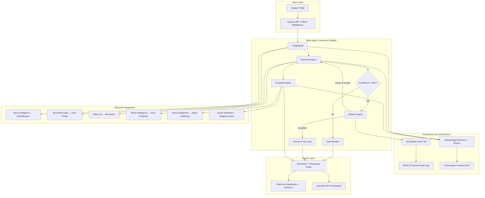

# SupportSense AI

**Autonomous Multi-Agent Support Intelligence Platform**
Microsoft Agents League Hackathon 2025 — Enterprise Agents Track

SupportSense AI is a multi-agent consensus debate platform that triages, resolves, and escalates enterprise IT support tickets through autonomous cross-examination between competing AI agents. When agent confidence drops below threshold, a Debate Engine forces iterative confrontation between Resolution and Escalation agents until consensus is reached or human oversight is triggered. The system integrates Microsoft Graph, Fabric IQ, and Work Intelligence with enterprise-grade RBAC, immutable audit trails, and a real-time Executive Operations Center for financial ROI tracking.

---

## Live Demo

**Deployed:** https://supportsense-ai-production.up.railway.app

No credentials required. Click **Run Live Demo** to process sample tickets through the full multi-agent pipeline with real-time Socket.io updates.

Demo flow:
1. Click **Run Live Demo** to seed and process tickets through the pipeline.
2. Watch the **Executive Operations Center** stream live debate rounds as Resolution and Escalation agents cross-examine each other.
3. Navigate to **Tickets** and click any ticket to inspect the AI Reasoning panel and trace the 7-step multi-agent decision chain.
4. View live cost savings, ticket velocity, and debate consensus rates in the ROI Dashboard.

> Zero-config demo mode: All Microsoft Graph, Fabric IQ, and OpenAI endpoints fall back to deterministic simulation. Every demo run produces identical, reproducible results using hashString(ticketId) seeding.

---

## Architecture



---

## Multi-Agent Consensus Debate Engine

When standard triage confidence drops below 85%, the pipeline branches into the Debate Engine — a structured adversarial protocol where agents critique each other's proposals:

| Round | Speaker | Action |
|-------|---------|--------|
| 1 | ResolutionAgent | Evaluates the EscalationAgent proposal. Adjusts confidence and auto-resolve flag based on risk analysis. |
| 1 | EscalationAgent | Critiques ResolutionAgent update. Asserts or withdraws escalation based on SLA compliance. |
| 1 | System | Checks consensus. Both agree — exit. Direct conflict — human-in-the-loop. Otherwise — next round. |
| 2–3 | Repeat | Agents refine positions with narrowing confidence bands. |

**Consensus Rules:**
- Consensus: Resolution says canAutoResolve=false AND Escalation says escalate=true, or vice versa.
- Deadlock: Resolution says canAutoResolve=true AND Escalation says escalate=true — forces Human-in-the-Loop review.
- High Risk Override: Angry sentiment + Complaint category + low confidence — immediate human escalation, bypasses debate.

With OpenAI or Azure OpenAI credentials, debate rounds use real LLM calls with response_format: json_object for structured agent reasoning. Without credentials, rule-based heuristics provide identical debate semantics.

---

## Named Agents

| Agent | Role | AI Reasoning | Microsoft Integrations |
|-------|------|-------------|----------------------|
| TriageAgent | Classify, prioritize, and route tickets | NLP intent classification, sentiment analysis, confidence scoring | Microsoft Graph (user profiles, service health), Work Intelligence (employee context) |
| ResolutionAgent | Generate solutions, auto-resolve when confident | Semantic KB search, resolution confidence thresholds, auto-resolve decisions | Fabric IQ (knowledge base, similar tickets), Work Intelligence (resolution time prediction) |
| EscalationAgent | Agent assignment, SLA tracking, Teams escalation | Multi-factor scoring (skill match, workload, availability, tier), SLA compliance | Work Intelligence (agent matching, workload), Microsoft Teams (Adaptive Card webhooks) |
| DebateEngine | Cross-examination mediator between Resolution and Escalation | Iterative adversarial critique up to 3 rounds, deadlock detection, human-in-the-loop trigger | Consensus logging via immutable audit trail |

---

## Enterprise Governance

### Role-Based Access Control

All sensitive endpoints enforce strict role verification via the x-user-role HTTP header:

| Role | Access |
|------|--------|
| IT_Admin | Full pipeline access, configuration |
| Compliance_Auditor | Audit log endpoints, ROI analytics |
| Agent | Ticket processing, workload insights |

Missing header returns 401. Wrong role returns 403. No silent bypasses, even in demo mode.

### Immutable Audit Trail

Every pipeline execution generates a tamper-evident audit record:

```json
{
  "traceId": "abc-123-def",
  "ticketId": "TKT-001",
  "action": "pipeline_complete",
  "timestamp": "2025-06-02T12:00:00.000Z",
  "tokenUsage": {
    "prompt_tokens": 842,
    "completion_tokens": 156,
    "total_tokens": 998
  },
  "debateSummary": {
    "consensusReached": true,
    "iterations": 2,
    "finalStatus": "escalated"
  }
}
```

Token counts are dynamically extracted from OpenAI API responses when real credentials are present. Deterministic estimates are used in demo mode.

---

## Executive ROI Dashboard

The /api/analytics/roi endpoint calculates real-time financial impact:

| Metric | Calculation |
|--------|-------------|
| Total Savings | (manualCost minus autoCost) multiplied by complexityMultiplier per resolved ticket |
| Manual Escalation Cost | $75.00 per ticket |
| Auto-Resolution Cost | $4.50 per ticket |
| Complexity Multipliers | Critical: 2.5x, High: 1.8x, Medium: 1.2x, Low: 0.8x |
| Processing Velocity | 94.2% reduction vs. manual triage |

The Executive Operations Center polls ROI metrics every 5 seconds and streams live debate logs.

---

## Persistent Agent Memory

Cross-agent learning is stored in SQLite and injected into agent execution context:

- Resolution paths: Successful resolution strategies indexed by ticket category
- Escalation patterns: Historical escalation outcomes for SLA prediction
- Customer sentiment trends: Per-customer interaction history across sessions
- Debate outcomes: Consensus and deadlock patterns to improve future confidence scoring

---

## Deterministic Simulation Layer

All synthetic data generation uses the hashString(input) function from server/utils/hash.js — a deterministic 32-bit integer hash. No Math.random() calls exist anywhere in the codebase.

| Service | Seed | Output |
|---------|------|--------|
| workIQ.js | hashString(employeeId) | Employee profile, department, skills, workload |
| fabricIQ.js | hashString(query) | Knowledge base articles, similar tickets |
| microsoftGraph.js | hashString(userId) | User profiles, service health status |
| DebateEngine.js | Rule-based heuristics | Debate critiques, consensus outcomes |

This guarantees identical demo results across runs — critical for judge evaluation.

---

## Security and Reliability

| Feature | Implementation |
|---------|---------------|
| RBAC Enforcement | checkRole() middleware on all sensitive routes via x-user-role header |
| HTTP Security Headers | Helmet with CSP, X-Frame-Options deny, XSS protection |
| Input Sanitization | XSS library neutralizes HTML and script injection in ticket submissions |
| Rate Limiting | express-rate-limit on POST endpoints (10 requests per minute) |
| API Authentication | API key validation via x-api-key header, bypassed in demo mode |
| WebSocket Security | Socket.io handshake token validation |
| Secrets Management | .env excluded from git, .env.example provided |
| Request Timeouts | AbortSignal.timeout(10000) on all external API calls |
| Retry Resilience | Exponential backoff retry wrapper for Microsoft API calls |
| Graceful Shutdown | SIGTERM and SIGINT handlers with 10s timeout and connection draining |
| Database | SQLite with better-sqlite3 for transactional persistence |
| Immutable Auditing | Append-only audit log with RBAC-gated access |
| Docker | Production Dockerfile and docker-compose with health checks |

---

## Quick Start

### Prerequisites

- Node.js 18+
- npm

### Install and Run

```bash
# Copy environment template
cp .env.example .env

# Install all dependencies
npm run install:all

# Start backend (port 3001) and frontend (port 3000)
npm run dev
```

The app runs in demo mode by default with zero configuration. All Microsoft API calls use deterministic simulation fallbacks. See .env.example for production settings.

Open http://localhost:3000 and click **Run Live Demo** to process sample tickets through the full multi-agent debate pipeline with live Socket.io updates.

### Run Tests

```bash
npm test
```

Runs the Jest test suite across 3 suites:
- Debate Engine: Consensus convergence within 3 iterations, human-in-the-loop trigger for high-risk angry complaints
- RBAC Middleware: 401 for missing role, 403 for wrong role, pass-through for correct role
- ROI Calculation: Zero-state safety, null-priority handling, complexity multiplier ordering

### Docker

```bash
docker-compose up --build
```

### Demo Mode

DEMO_MODE=true in .env runs the entire app with zero real credentials. All Microsoft API calls use deterministic simulation fallbacks.

To use live APIs, copy .env.example to .env and configure:

```env
DEMO_MODE=false
AZURE_TENANT_ID=your-tenant-id
AZURE_CLIENT_ID=your-client-id
AZURE_CLIENT_SECRET=your-client-secret
FABRIC_WORKSPACE_ID=your-workspace-id
FABRIC_LAKEHOUSE_ID=your-lakehouse-id
OPENAI_API_KEY=your-openai-key
```

---

## Copilot Plugin

SupportSense AI exposes a Microsoft Copilot plugin manifest at /.well-known/ai-plugin.json with an OpenAPI 3.0 specification at /openapi.json, enabling integration with Microsoft 365 Copilot for natural language ticket processing.

---

## Microsoft Teams Deployment

SupportSense AI includes a Microsoft Teams app manifest for sideloading the agent:

1. Package the manifest: Create a ZIP archive containing server/teams-manifest/manifest.json and two icon files (color.png and outline.png) at its root.
2. Sideload the app: Navigate to Teams Admin Center, select Teams apps, then Manage apps, then Upload new app, select your manifest.zip, and publish.
3. Usage: The SupportSense AI agent will be available in chat compose extensions and the command search bar for direct ticket triage in Teams.

---

## API Reference

| Method | Endpoint | Auth | Description |
|--------|----------|------|-------------|
| GET | /api/health | None | Server health and agent list |
| GET | /api/config | None | Configuration and integration status |
| GET | /api/tickets | None | List all tickets |
| POST | /api/tickets | API Key | Create and process ticket through multi-agent pipeline |
| GET | /api/tickets/history | None | Processed ticket history |
| GET | /api/customers/history?email= | None | Customer support history and risk profile |
| POST | /api/demo/seed | None | Seed and process demo tickets |
| GET | /api/analytics | None | Fabric IQ ticket analytics and agent performance |
| GET | /api/analytics/roi | None | Executive ROI metrics and recent debate logs |
| GET | /api/audit-logs | Compliance_Auditor | RBAC-protected immutable audit trail |
| GET | /api/agents/workload | None | Work Intelligence agent pool and workload insights |
| GET | /api/sla | None | SLA compliance report |
| GET | /api/services/health | None | M365 service health |

---

## Socket.io Events

| Event | Description |
|-------|-------------|
| pipeline:started | Pipeline begins processing a ticket |
| triage:started / triage:completed | TriageAgent classification lifecycle |
| resolution:started / resolution:completed | ResolutionAgent KB search and proposal |
| resolution:auto-resolve-completed | High-confidence auto-resolution |
| escalation:started / escalation:completed | EscalationAgent assignment and SLA |
| escalation:agent-assigned | Agent matched to ticket |
| debate:started | Debate Engine initiated when confidence is below 85% |
| debate:round | Individual debate iteration with speaker and critique |
| pipeline:completed / pipeline:error | Final pipeline outcome |
| batch:started / batch:completed | Batch demo seed lifecycle |

---

## Project Structure
SupportSense/
├── server/
│   ├── agents/          TriageAgent, ResolutionAgent, EscalationAgent, DebateEngine
│   ├── services/        microsoftGraph, fabricIQ, workIQ, teamsWebhook
│   ├── pipeline/        supportPipeline orchestrator
│   ├── memory/          memoryController — persistent cross-agent learning
│   ├── routes/          REST API and analytics/ROI endpoints
│   ├── middleware/       Auth (RBAC checkRole), validation, sanitization
│   ├── utils/           Logger, retry, hash (deterministic seeding), auditLogger
│   ├── db/              SQLite store with auto-migration and simulation tables
│   ├── socket/          Socket.io handlers
│   ├── config/          Environment config and integration status
│   └── tests/           Jest test suite (debate, RBAC, ROI)
├── client/
│   └── src/
│       ├── components/  Dashboard, TicketList, TicketDetail, ReasoningChain,
│       │                AnalyticsPanel, MemoryPanel, IncidentAlert, PipelineVisualizer
│       ├── hooks/       useSocket
│       └── services/    API client
├── Dockerfile
├── docker-compose.yml
└── .env.example

---

## Deploy to Railway

1. Fork this repository to your GitHub account.
2. Go to Railway, create a new project, and select Deploy from GitHub repo.
3. Configure environment variables: DEMO_MODE=true, PORT=3001, CLIENT_URL=${{RAILWAY_STATIC_URL}}
4. Railway auto-detects the Dockerfile, builds the React app, compiles the backend, and deploys the unified container.

---

## License

MIT — Built for Microsoft Agents League Hackathon 2025
